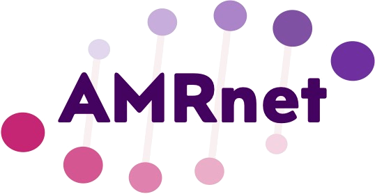

     
 


 

[](https://zenodo.org/doi/10.5281/zenodo.10810218)
[]
[]
[]
[]
Visiting the [AMRnet dashboard](https://amrnetdev2-bda07af7e807.herokuapp.com/) for more informations.

## Installation (for software development purposes only)

### Step 1. Install GIT, NPM and MongoDB

To install GIT, please visit [https://git-scm.com/](https://git-scm.com/).

To install NPM, please visit [https://www.npmjs.com/get-npm](https://www.npmjs.com/get-npm).

To install MongoDB, please visit [https://www.mongodb.com/try/download/community?tck=docs_server](https://www.mongodb.com/try/download/community?tck=docs_server).

Note: While installing MongoDB, check the option to install MongoDB Compass. If there's no option, you can download it here: [https://www.mongodb.com/try/download/compass](https://www.mongodb.com/try/download/compass).

### Step 2. Install YARN with the command

```bash
npm install -g yarn
```

## Table of Contents
- [Installation](#installation)
- [User guide](#user-guide)
- [Citing](#citing)
- [Funding & acknowledgements](#funding-acknowledgements)


## Description
 
 The AMRnet dashboard aims to make high-quality, robust and reliable genome-derived AMR surveillance data accessible to a wide audience. Visualizations are geared towards showing national annual AMR prevalence estimates and trends, that can be broken down and explored in terms of underlying genotypes and resistance mechanisms. We do not generate sequence data, but we hope that by making publicly deposited data more accessible and useful, we can encourage and motivate more sequencing and data sharing.
 
 We started with Salmonella Typhi, built on our TyphiNET dashboard which uses data curated by the Global Typhoid Genomics Consortium (to improve data quality and identify which datasets are suitable for inclusion) and analysed in Pathogenwatch (to call AMR determinants and lineages from sequence data). More organisms will be added throughout 2024-25, using data sourced from analysis platforms such as Pathogenwatch, Enterobase, and potentially others.
 
-Visiting the AMRnet dashboard for more informations.
Visit the AMRnet dashboard for more information.
 
## Installation (for software development purposes only)
 
#### 1. Install

#### 1. Install <a href="https://git-scm.com/">GIT</a>, <a href="https://www.npmjs.com/get-npm">NPM</a> and <a href="https://www.mongodb.com/try/download/community?tck=docs_server">MongoDB</a>
Context:
```markdown
### 1. Prerequisites: Install Git, Node.js (with npm), and MongoDB
 
Visiting the [AMRnet dashboard](https://amrnetdev2-bda07af7e807.herokuapp.com/) for more informations.
*   **Git:** Download from [git-scm.com](https://git-scm.com/).
*   **Node.js and npm:** Download from [npmjs.com/get-npm](https://www.npmjs.com/get-npm) (npm is included with Node.js).
*   **MongoDB Community Server:** Download from [mongodb.com](https://www.mongodb.com/try/download/community?tck=docs_server).

**Note:** While installing MongoDB, check the option to install MongoDB Compass. If not available during installation, download Compass separately from [mongodb.com/try/download/compass](https://www.mongodb.com/try/download/compass).
 
## Installation (for software development purposes only)

#### 1. Install <a href="https://git-scm.com/">GIT</a>, <a href="https://www.npmjs.com/get-npm">NPM</a> and <a href="https://www.mongodb.com/try/download/community?tck=docs_server">MongoDB</a>

Note: While installing MongoDB, check the option to install MongoDB Compass. If there's no option, you can download it here:` <a href="https://www.mongodb.com/try/download/compass">MongoDB Compass</a> 

#### 2. Install YARN with the command

<a href="https://git-scm.com/">GIT</a>, <a href="https://www.npmjs.com/get-npm">NPM</a> and <a href="https://www.mongodb.com/try/download/community?tck=docs_server">MongoDB</a>

Note: While installing MongoDB, check the option to install MongoDB Compass. If there's no option, you can download it here:` <a href="https://www.mongodb.com/try/download/compass">MongoDB Compass</a>

#### 2. Install YARN with the command

```sh
### 2. Install Yarn globally
```bash
npm install -g yarn

#### 3. On the command line, run the commands

```sh
git clone https://github.com/amrnet/amrnet
```

#### 4. Inside the project folder run this command to install the server dependencies

```sh
### 4. Install Server Dependencies
In the project root folder (`amrnet`), run:
```bash
npm install

#### 5. Inside the folder `/client`, run the previous command to install the client dependencies

#### 6. Inside the project folder, create a file named `.env`. Inside it, copy the following code

```sh
MONGO_URI= (see item 7 from the manual)
MONGO_URI_ATLAS=(see item 7 from manual to access MongoDB Atlas cloud)
```


#### 7. When opening MongoDB Compass, you will see a white box with a connection string. Copy this string and paste it on the variable `MONGO_URI`. After clicking the `Connect` button
### 7. Obtain Local MongoDB Connection String (for `MONGO_URI`)
1.  Open MongoDB Compass.
2.  When connecting to your local MongoDB instance, Compass will use or show a connection string. This typically looks like `mongodb://localhost:27017` or `mongodb://127.0.0.1:27017`.
3.  Copy this local connection string.
4.  Paste it as the value for `MONGO_URI` in your `.env` file.

#### 8. Finally, inside the project folder, run the command and wait for the program to open on your browser

```sh
### 8. Run the Application
From the project root folder, run the command and wait for the program to open in your browser:
```bash
yarn start: prod

## Citing

If you use data/metadata from the AMRnet dashboard, or the analysis based on these data, please cite:

DOI: <https://zenodo.org/doi/10.5281/zenodo.10810218>
GitHub: <https://github.com/amrnet/amrnet/>

## Funding & acknowledgements

AMRnet is funded by the Wellcome Trust and based in Kat Holt's group at the London School of Hygiene and Tropical Medicine.