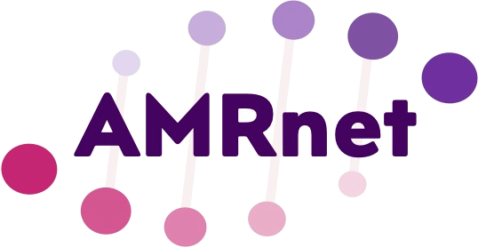

[](https://github.com/amrnet/amrnet)
[](https://www.gnu.org/licenses/gpl-3.0)
[](https://github.com/amrnet/amrnet/commits/main)
[](https://github.com/amrnet/amrnet/issues)
[](https://github.com/amrnet/amrnet/stargazers)
[](https://github.com/amrnet/amrnet)
[](https://zenodo.org/doi/10.5281/zenodo.10810218)
[](https://doi.org/10.1093/nar/gkaf1101)

<p align="center">
  <em><b>Making genome-derived AMR surveillance data accessible worldwide</b></em>
</p>

**🔗 Quick Links:** [🌐 Live Dashboard](https://www.amrnet.org) •
[📖 Documentation](https://amrnet.readthedocs.io) •
[🚀 Quick Start](#-quick-start) •
[💬 Community](https://github.com/amrnet/amrnet/discussions)

## 🎯 Overview

AMRnet is a comprehensive web-based platform that transforms complex
antimicrobial resistance (AMR) genomic surveillance data into accessible,
interactive visualizations. Our mission is to democratize access to high-quality
AMR data for researchers, public health professionals, and policymakers
worldwide.

### ✨ Key Features

- **🗺️ Interactive Global Maps** - Visualize resistance patterns across
  countries and regions
- **📊 Trend Analysis** - Track resistance changes over time with dynamic graphs
- **🔍 Advanced Filtering** - Explore data by organism, drug, genotype, and
  geography
- **🌍 Multi-Language Support** - Available in English, French, Portuguese, and
  Spanish
- **📱 Responsive Design** - Optimized for desktop, tablet, and mobile devices
- **📁 Data Export** - Download filtered datasets for further analysis
- **🔌 API Access** - Programmatic access to all data with comprehensive
  documentation

### 🦠 Supported Organisms (10 Species)

| Organism                    | Scientific Name              | Key Features                                |
| --------------------------- | ---------------------------- | ------------------------------------------- |
| **S. Typhi**                | _Salmonella_ Typhi           | Typhoid fever, QRDR pathway analysis        |
| **Salmonella**              | _Salmonella enterica_        | Non-typhoidal Salmonella, QRDR + qnr rules |
| **Invasive Salmonella**     | _Salmonella_ (invasive NTS)  | Bloodstream infections, QRDR analysis       |
| **K. pneumoniae**           | _Klebsiella pneumoniae_      | Healthcare-associated, convergence mapping  |
| **N. gonorrhoeae**          | _Neisseria gonorrhoeae_      | STI surveillance, QRDR patterns             |
| **E. coli**                 | _Escherichia coli_           | AMR gene tracking                           |
| **Diarrheagenic E. coli**   | _Escherichia coli_ (DEC)     | Diarrheal disease surveillance              |
| **Shigella**                | _Shigella_ spp.              | Dysentery and MDR monitoring                |
| **S. aureus**               | _Staphylococcus aureus_      | MRSA surveillance                           |
| **S. pneumoniae**           | _Streptococcus pneumoniae_   | PMEN clone tracking, PCV serotypes          |

## 🚀 Quick Start

### For Users

1. **🌐 Visit the Dashboard**: Go to [amrnet.org](https://www.amrnet.org)
2. **🦠 Select an Organism**: Choose from our supported organisms
3. **🔍 Apply Filters**: Customize your view by geography, time, and resistance
4. **📊 Explore Visualizations**: Interact with maps and graphs
5. **📥 Export Data**: Download results for your analysis

### For Developers

```bash
# Clone the repository
git clone https://github.com/amrnet/amrnet.git
cd amrnet

# Install dependencies
npm install
cd client && npm install && cd ..

# Set up environment
cp .env.example .env
# Edit .env with your MongoDB connection string

# Start development servers
npm run start:dev
```

Visit `http://localhost:3000` to see the application running locally.

**📚 Need more details?** Check our
[Installation Guide](https://amrnet.readthedocs.io/en/latest/installation.html)
and [Developer Guide](./tutorial/developer_guide.md).

## 🏗️ Platform Architecture

AMRnet employs a modern, scalable MERN stack architecture designed to handle
large-scale genomic surveillance data with enterprise-grade performance.

### 🎯 Interactive Architecture Diagrams

We provide comprehensive visual documentation of our platform architecture:

<table>
<tr>
<td align="center" width="50%">

**📊 Macro Architecture View**

[](./assets/html/amrnet_architecture_macro.html)

_High-level overview of the four main architectural layers_

</td>
<td align="center" width="50%">

**🔬 Detailed Component View**

[](./assets/html/amrnet_architecture_expand.html)

_Comprehensive data pipeline and component breakdown_

</td>
</tr>
</table>

### 🏛️ Four-Layer Architecture

```text
📱 Frontend Layer (React 18)
├── 🎨 Interactive UI Components with Material-UI
├── 📊 D3.js Data Visualizations & Dynamic Charts
├── 🗺️ Geographic Maps with React Simple Maps
├── 🌍 Multi-language Support (EN, ES, FR, PT)
└── 📱 Progressive Web App with Offline Capabilities

⚙️ Backend Layer (Node.js/Express)
├── 🛡️ RESTful API with Rate Limiting & Authentication
├── ⚡ Optimized Endpoints with 70-87% Performance Gains
├── 🗜️ Advanced Compression (90% Payload Reduction)
├── 🔒 Security Framework (Helmet, CORS, OAuth2)
└── 📊 Real-time Data Processing Pipelines

🗄️ Database Layer (MongoDB 7)
├── 📋 10 Organism Databases (1.6M+ Genomes)
├── ⚡ Performance Indexes for Geographic & Temporal Queries
├── 🔄 Aggregation Pipelines for Server-side Processing
├── 🔐 Authentication with Role-based Access Control
└── 💾 Daily Automated Backups to AWS S3

🌐 Infrastructure Layer (AWS)
├── 🖥️ EC2 (t3.xlarge) — Production + MongoDB co-hosted
├── 🌍 CloudFront CDN — Global edge caching + HTTPS
├── 📁 S3 Data Lake — Exports, backups, raw data
├── 🔒 ACM SSL Certificate — Auto-renewing HTTPS for amrnet.org
├── 🔌 Public REST API — Swagger docs + token authentication
└── 🔄 CI/CD — Git-based deploy scripts (main → production)
```

### 🔧 Technology Stack

AMRnet leverages cutting-edge technologies for optimal performance:

```text
Frontend Technologies
├── ⚛️ React 18 with Hooks & Functional Components
├── 🎨 Material-UI v5 for Modern Design System
├── 📊 D3.js for Interactive Data Visualizations
├── 🗺️ React Simple Maps for Geographic Visualizations
├── 🌍 react-i18next for Internationalization
├── 📱 Progressive Web App Features
└── ⚡ Performance: Code Splitting, Lazy Loading, Service Workers

Backend Technologies
├── 🟢 Node.js v22 with Express.js Framework
├── 🗄️ MongoDB 7 with native driver
├── 🔒 Authentication: API Keys with self-service registration
├── 🛡️ Security: CORS, Rate Limiting (nginx), MongoDB auth
├── ⚡ Data Processing: Aggregation Pipelines, Field Projection
├── 🗜️ Compression: gzip (nginx + Express)
├── 📖 Swagger/OpenAPI Documentation
└── 📊 PM2 Process Manager with auto-restart

Database & Infrastructure
├── 🗄️ MongoDB 7 (self-hosted on EC2, auth enabled)
├── 📁 AWS S3 Data Lake (exports, backups, raw data)
├── 🖥️ AWS EC2 (t3.xlarge) for Production
├── 🌍 AWS CloudFront CDN for Global Access
├── 🔒 AWS ACM for SSL Certificates
├── 🔄 Git-based deployment (development → main)
└── 📊 Health checks + daily S3 backups
```

### 🎯 Performance Metrics

Our architecture delivers enterprise-grade performance with measurable
improvements:

| Metric               | Before Optimization | After Optimization | Improvement          |
| -------------------- | ------------------- | ------------------ | -------------------- |
| **Load Times**       | 3.2s average        | 0.4-1.0s average   | **70-87% faster**    |
| **Payload Size**     | 2.1MB average       | 0.2-1.0MB average  | **60-90% reduction** |
| **API Capacity**     | 2,000 req/hour      | 10,000+ req/hour   | **500% increase**    |
| **Database Queries** | 800ms average       | 120ms average      | **85% faster**       |

### 📊 Data Coverage & Sources

AMRnet integrates surveillance data from major public genomic databases:

**🦠 Supported Organisms (10 Species)**

- **Salmonella Typhi** - Global typhoid surveillance from Pathogenwatch
- **Salmonella enterica** - Non-typhoidal Salmonella from Enterobase
- **Invasive Salmonella** - Bloodstream infections from Enterobase
- **Klebsiella pneumoniae** - Healthcare-associated infections from Pathogenwatch
- **Neisseria gonorrhoeae** - STI surveillance from Pathogenwatch
- **Escherichia coli** - AMR gene tracking from Enterobase
- **Diarrheagenic E. coli** - Diarrheal disease surveillance from Enterobase
- **Shigella species** - Shigellosis surveillance from Enterobase
- **Staphylococcus aureus** - MRSA surveillance from Pathogenwatch
- **Streptococcus pneumoniae** - Pneumococcal resistance from Pathogenwatch

**🌍 Global Coverage**

- **1,600,000+ genomic records** with AMR predictions
- **100+ countries** represented across all continents
- **4 languages** supported (English, Spanish, French, Portuguese)
- **WHO GLASS integration** for phenotypic surveillance data

**🔬 Data Sources**

- **[Pathogenwatch](https://pathogen.watch)** - S. Typhi, K. pneumoniae, N. gonorrhoeae, S. aureus, S. pneumoniae
- **[Enterobase](https://enterobase.warwick.ac.uk)** - E. coli, Shigella, Salmonella enterica, invasive NTS, DEC
- **[NCBI](https://www.ncbi.nlm.nih.gov)** - Public genome repositories
- **[PubMLST](https://pubmlst.org)** - Multi-locus sequence typing
- **[WHO GLASS](https://www.who.int/initiatives/glass)** - Global antimicrobial resistance surveillance
- **Academic consortiums** - Global Typhoid Genomics Consortium

### 🔗 Architecture Documentation

For comprehensive technical documentation, visit:

- **📊
  [Interactive Architecture Diagrams](https://amrnet.readthedocs.io/en/latest/architecture.html)** -
  Visual platform overview
- **🔧 [Developer Guide](DEVELOPER_GUIDE.md)** - Implementation details and
  contribution guide
- **🌐 [API Documentation](https://amrnet.readthedocs.io/en/latest/api.html)** -
  Complete RESTful API reference

## 📖 Documentation

| Resource              | Description                           | Link                                                                       |
| --------------------- | ------------------------------------- | -------------------------------------------------------------------------- |
| **User Guide**        | Complete dashboard usage instructions | [📖 Read the Docs](https://amrnet.readthedocs.io/en/latest/userguide.html) |
| **API Documentation** | RESTful API reference and examples    | [🔌 API Docs](https://amrnet.readthedocs.io/en/latest/api.html)            |
| **Developer Guide**   | Adding new organisms and contributing | [🛠️ Dev Guide](DEVELOPER_GUIDE.md)                                         |
| **Data Dictionary**   | Data structure and field definitions  | [📊 Data Docs](https://amrnet.readthedocs.io/en/latest/data.html)          |

## 🛠️ Installation

### Prerequisites

- **Node.js** 22+ with npm
- **MongoDB** 7.0+ (local or Atlas cloud)
- **Git** for version control
- **AWS CLI** (for deployment to production)

### Development Setup

1. **Clone and Install**:

   ```bash
   git clone https://github.com/amrnet/amrnet.git
   cd amrnet
   npm install
   ```

2. **Client Dependencies**:

   ```bash
   cd client
   npm install
   cd ..
   ```

3. **Environment Configuration**:

   ```bash
   cp .env.example .env
   ```

   Edit `.env` with your configuration:

   ```env
   MONGODB_URI=mongodb://localhost:27017
   NODE_ENV=development
   PORT=8080
   REACT_APP_API_URL=/api/
   ```

4. **Start Development Servers**:
   ```bash
   npm run start:dev
   ```

The application will be available at `http://localhost:3000` with hot reloading
enabled.

### Production Deployment (AWS)

AMRnet runs on AWS EC2 with MongoDB, nginx, and CloudFront CDN.

```bash
# Deploy scripts are in deploy/
./deploy/deploy-production.sh   # Deploy main branch to production
./deploy/deploy-dev.sh          # Deploy development branch to dev instance
./deploy/promote-to-production.sh  # Merge dev → main and deploy
```

**Infrastructure:**

| Component | Service | Details |
| --------- | ------- | ------- |
| **App + DB** | EC2 t3.xlarge | Node.js 22 + MongoDB 7 (co-hosted) |
| **CDN** | CloudFront | Global edge caching, HTTPS via ACM |
| **Data Lake** | S3 | Exports, backups, raw data pipeline |
| **Domain** | amrnet.org | SSL certificate auto-renewed by ACM |
| **Backups** | S3 + cron | Daily MongoDB backups at 3 AM UTC |

**Git Workflow:**

```text
development branch → deploy to dev → researchers validate → promote to main → production
```

## 🔌 API Access

AMRnet provides a public REST API with Swagger documentation for programmatic access to all data.

**🔗 API Links:**
[📖 Swagger Docs](https://www.amrnet.org/api-docs) |
[🔑 Register for API Key](https://www.amrnet.org/api-register)

### Quick Examples

```bash
# Register for an API key at https://www.amrnet.org/api-register
# Then use it in all requests:

# List all organisms
curl -H "X-API-Key: YOUR_KEY" https://www.amrnet.org/api/v1/organisms

# Get resistance summary for Salmonella
curl -H "X-API-Key: YOUR_KEY" "https://www.amrnet.org/api/v1/organisms/senterica/resistance?country=Brazil"

# Get per-country genome counts
curl -H "X-API-Key: YOUR_KEY" https://www.amrnet.org/api/v1/organisms/ecoli/countries

# Download full dataset as CSV
curl -H "X-API-Key: YOUR_KEY" "https://www.amrnet.org/api/v1/organisms/styphi/download?format=csv" -o styphi.csv
```

### Python Integration

```python
import requests
import pandas as pd

API_KEY = "your-api-key-here"
BASE = "https://www.amrnet.org/api/v1"
HEADERS = {"X-API-Key": API_KEY}

# Get resistance data for E. coli filtered by country and year
response = requests.get(f"{BASE}/organisms/ecoli/resistance",
                       params={"country": "United Kingdom", "year_from": 2020},
                       headers=HEADERS)
data = response.json()
print(f"Resistance data for {data['organism']}: {data['sampled']} genomes")

# Download paginated genome data
response = requests.get(f"{BASE}/organisms/senterica/genomes",
                       params={"page": 1, "limit": 500},
                       headers=HEADERS)
df = pd.DataFrame(response.json()["data"])
print(f"Retrieved {len(df)} genomes")
```

### Available Endpoints

| Endpoint | Description |
| -------- | ----------- |
| `GET /api/v1/organisms` | List all organisms with genome counts |
| `GET /api/v1/organisms/{id}/resistance` | Resistance prevalence by drug |
| `GET /api/v1/organisms/{id}/genomes` | Paginated individual genome records |
| `GET /api/v1/organisms/{id}/countries` | Per-country summary with year ranges |
| `GET /api/v1/organisms/{id}/download` | Full dataset download (JSON or CSV) |

## 🤝 Contributing

We welcome contributions from the global AMR surveillance community!

### Ways to Contribute

- **🐛 Report Bugs**:
  [Create an issue](https://github.com/amrnet/amrnet/issues/new?template=bug_report.md)
- **💡 Suggest Features**:
  [Request features](https://github.com/amrnet/amrnet/issues/new?template=feature_request.md)
- **🔧 Submit Code**:
  [Fork and create pull requests](https://github.com/amrnet/amrnet/fork)
- **📖 Improve Documentation**: Help us make docs better
- **🦠 Add Organisms**: Follow our [Developer Guide](DEVELOPER_GUIDE.md)

### Development Workflow

1. **Fork** the repository
2. **Create** a feature branch (`git checkout -b feature/amazing-feature`)
3. **Commit** your changes (`git commit -m 'Add amazing feature'`)
4. **Push** to the branch (`git push origin feature/amazing-feature`)
5. **Open** a Pull Request

### Code Standards

- **ESLint**: Follow our JavaScript style guide
- **Prettier**: Code formatting consistency
- **JSDoc**: Document all functions and components
- **Testing**: Include unit tests for new features

**📋 Full Contributing Guide**: [CONTRIBUTING.md](CONTRIBUTING.md)

## 📜 Citation & Licensing

### How to Cite

If you use **AMRnet** data or visualizations in your work, please cite:

Cerdeira LT, Dyson ZA, Sharma V, et al. AMRnet: a data visualization platform to
interactively explore pathogen variants and antimicrobial resistance. Nucleic
Acids Res. Published online November 6, 2025.
doi:[10.1093/nar/gkaf1101](https://doi.org/10.1093/nar/gkaf1101)

### License

AMRnet is released under the **GNU General Public License v3.0** (GPL-3.0).

- ✅ **Use** - Commercial and non-commercial use allowed
- ✅ **Modify** - Create derivative works and modifications
- ✅ **Distribute** - Share original and modified versions
- ⚠️ **Share Alike** - Derivatives must use GPL-3.0 license
- ⚠️ **Disclose Source** - Source code must be made available

See [LICENSE](LICENSE) for full details.

## 🎯 Funding & Acknowledgments

### Primary Funding

AMRnet is proudly funded by:

- **🏛️ Wellcome Trust** - Core platform development and maintenance
- **🎓 London School of Hygiene & Tropical Medicine** - Institutional support
- **🤝 Global Partnership** - International collaboration network

### Acknowledgments

We gratefully acknowledge:

- **Global Typhoid Genomics Consortium** - Data curation and expertise
- **Pathogenwatch Team** - Bioinformatics pipeline support
- **EnteroBase Contributors** - Database infrastructure
- **Open Source Community** - Technology stack and tools
- **International Collaborators** - Data sharing and validation

## 🆘 Support & Community

### Getting Help

| Type                 | Resource                                                           | Response Time |
| -------------------- | ------------------------------------------------------------------ | ------------- |
| 🐛 **Bugs**          | [GitHub Issues](https://github.com/amrnet/amrnet/issues)           | 1-3 days      |
| 💡 **Features**      | [GitHub Discussions](https://github.com/amrnet/amrnet/discussions) | 3-7 days      |
| 📧 **General**       | [amrnetdashboard@gmail.com](mailto:amrnetdashboard@gmail.com)      | 5-10 days     |
| 📖 **Documentation** | [Read the Docs](https://amrnet.readthedocs.io)                     | Self-service  |

### Community Guidelines

We're committed to fostering an inclusive, welcoming community:

- **🤝 Be Respectful** - Treat all community members with courtesy
- **🎯 Stay On Topic** - Keep discussions relevant to AMR surveillance
- **📚 Help Others** - Share knowledge and assist newcomers
- **🔍 Search First** - Check existing issues before creating new ones
- **📝 Be Clear** - Provide detailed bug reports and feature requests

---

## � Contact & Links

**AMRnet** - Powered by AMRnet team.

[🌐 Dashboard](https://www.amrnet.org) •
[📖 Docs](https://amrnet.readthedocs.io) •
[💻 GitHub](https://github.com/amrnet/amrnet) •
[📧 Contact](mailto:amrnetdashboard@gmail.com)

> Making AMR surveillance data accessible to everyone, everywhere
