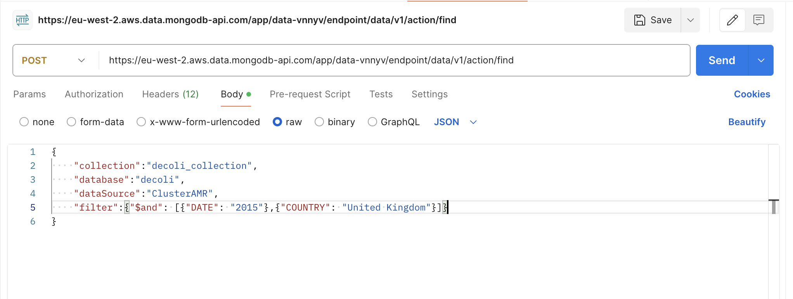

# File: docs/source/api.rst
Data access
===========

The full sample-level data for each organism can be downloaded from the AMRnet dashboard itself, using the ‘Download database (CSV) format’ button at the bottom of the page. In addition, you can access AMRnet data via the API described below.

**Architectures**: The API architectures have 2 options developed for the project which include:

.. **OPTION 1:**

.. .. figure:: assets/apiauth1.png
..    :width: 100%
..    :align: center
..    :alt: api

.. .. figure:: assets/arrow.png
..    :width: 100%
..    :align: center
..    :alt: api

.. .. figure:: assets/apiauth2.png
..     :width: 100%
..     :align: center
..     :alt: api

.. **OPTION 2:**

.. .. figure:: assets/apidatalake1.png
..    :width: 100%
..    :align: center
..    :alt: api

.. .. figure:: assets/arrow.png
..    :width: 100%
..    :align: center
..    :alt: api

.. .. figure:: assets/apidatalake2.png
..     :width: 100%
..     :align: center
..     :alt: api

.. **OPTION 3:**

.. .. figure:: assets/apigui1.png
..    :width: 100%
..    :align: center
..    :alt: api

.. .. figure:: assets/arrow.png
..    :width: 100%
..    :align: center
..    :alt: api

.. .. figure:: assets/apigui2.png
..     :width: 100%
..     :align: center
..     :alt: api

1. Download data via bucket
---------------------------

.. note:: **Organism name for downloading files from AWS:**
    Escherichia coli (diarrheagenic) as ``decoli``;
    Escherichia coli as ``ecoli``;
    Klebsiella pneumoniae as ``kpneumo``;
    Neisseria gonorrhoeae as ``ngono``;
    Salmonella (invasive non-typhoidal) as ``sentericaints``;
    Salmonella (non-typhoidal) as ``senterica``;
    Shigella as ``shige``;
    Salmonella Typhi as ``styphi``

a. Data accessing using Browser
******************************************

i. Viewing Available Files
~~~~~~~~~~~~~~~~~~~~~~~~~~~
* Step 1: Open a web browser (Chrome, Firefox, Safari, etc.).
* Step 2: Navigate to the root bucket URL by clicking `https://amrnet.s3.amazonaws.com/ <https://amrnet.s3.amazonaws.com/>`_.
* Step 3: This URL leads to an XML text representation listing all the files available in the Amazon S3 bucket. The XML format will display information about each file, such as its key (name), last modified date, size, etc.

ii. Searching for a Specific Organism
~~~~~~~~~~~~~~~~~~~~~~~~~~~~~~~~~~~~~~~
* Step 1: Use the search functionality of your browser (Ctrl-F on Windows/Linux or Cmd-F on Mac).
* Step 2: Type the name of file based on the organism you are looking for in the search box. This will highlight all occurrences of the organism's name in the XML text, making it easier to locate the specific file associated with that organism.

iii. Downloading a File
~~~~~~~~~~~~~~~~~~~~~~~~
* Step 1: Once you find the ``<Key>`` field that contains the file name you are interested in, note down the file name.
* Step 2: Open a new tab in your browser.
* Step 3: Copy the root bucket URL ``https://amrnet.s3.amazonaws.com`` into the new tab's address bar.
* Step 4: Append a slash ``/`` to the end of the URL, followed by the contents of the ``<Key>`` field (file name).
* Step 5: Press Enter, and your browser should automatically start downloading the file. This method has been tested to work in Chrome, Firefox, and Safari.

**OR**

* Copy the URL below and modify the organism name added at the end **amrnet-** ``decoli`` **.csv** based on organism list given above.

Example:

.. code-block:: bash

    https://amrnet.s3.amazonaws.com/amrnet-latest/amrnet-decoli.csv

b. Data accessing using Command line
************************************************

* Step 1: Open your terminal.
* Step 2: Use the following command to download data from the provided URL:

.. code-block:: bash

    curl -O https://amrnet.s3.amazonaws.com/

Similarly, if you need to download a specific file from the URL, you would specify the file name in the URL. For example:

.. code-block:: bash

    curl -O https://amrnet.s3.amazonaws.com/filename

Example:

.. code-block:: bash

    curl -O https://amrnet.s3.amazonaws.com/amrnet-latest/amrnet-shige.csv

c. Data accessing using Using S3cmd tool
***************************************************

The `s3cmd <https://s3tools.org/s3cmd>`_ tool is a versatile and powerful command-line utility designed to interact with Amazon S3 (Simple Storage Service). It simplifies tasks such as browsing, downloading, and syncing files from S3 buckets. This tool is particularly useful for managing large datasets and automating workflows involving S3 storage.

2. Download data via API
------------------------

1. Send an email to amrnet.api@gmail.com requesting an API token.

Example:

.. code-block:: bash

        Subject: Request for API Token

.. code-block:: bash

        I am writing to request an API token for accessing the AMRnet database. Below are the specific details for my request:

        Organism Name: Escherichia coli

2. You will receive email from us with all the necessary detailed. like: **API_TOKEN_KEY, collection, database, dataSource**.
3. Once you received these details use the method below to download required data.
4. To download data with specific COUNTRY and DATE add a **filter**.

Example code to download all the data for an organism:

.. code-block:: bash

    curl --location --request POST 'https://eu-west-2.aws.data.mongodb-api.com/app/data-vnnyv/endpoint/data/v1/action/find' \
            --header 'Content-Type: application/json' \
            --header 'Access-Control-Request-Headers: *' \
            --header 'api-key: <API_TOKEN_KEY>' \
            --data-raw '{
                "collection":"<COLLECTION_NAME>",
                "database":"<DATABASE_NAME>",
                "dataSource":"<dataSource_NAME>"
            }'

Example code to download the data with filters **DATE** and **COUNTRY** for an organism:

.. code-block:: bash

    curl --location --request POST 'https://eu-west-2.aws.data.mongodb-api.com/app/data-vnnyv/endpoint/data/v1/action/find' \
            --header 'Content-Type: application/json' \
            --header 'Access-Control-Request-Headers: *' \
            --header 'api-key: <API_TOKEN_KEY>' \
            --data-raw '{
                "collection":"<COLLECTION_NAME>",
                "database":"<DATABASE_NAME>",
                "dataSource":"<dataSource_NAME>",
                "filter": {"$and": [{"DATE": "2015"},{"COUNTRY": "United Kingdom"}]}
            }'

Example code to download the data with only one filter e.g. **DATE** for an organism:

.. code-block:: bash

    curl --location --request POST 'https://eu-west-2.aws.data.mongodb-api.com/app/data-vnnyv/endpoint/data/v1/action/find' \
            --header 'Content-Type: application/json' \
            --header 'Access-Control-Request-Headers: *' \
            --header 'api-key: <API_TOKEN_KEY>' \
            --data-raw '{
                "collection":"<COLLECTION_NAME>",
                "database":"<DATABASE_NAME>",
                "dataSource":"<dataSource_NAME>",
                "filter": {"DATE": "2015"}
            }'

Example code to download the data and save in JSON:

.. code-block:: bash
    curl --location --request POST 'https://eu-west-2.aws.data.mongodb-api.com/app/data-vnnyv/endpoint/data/v1/action/find' \
            --header 'Content-Type: application/json' \
            --header 'Access-Control-Request-Headers: *' \
            --header 'api-key: <API_TOKEN_KEY>' \
            --data-raw '{
                "collection":"<COLLECTION_NAME>",
                "database":"<DATABASE_NAME>",
                "dataSource":"<dataSource_NAME>",
                "filter": {"DATE": "2015"}
            }' > output.json

Example code to download the data and save in JSON

.. code-block:: bash

    curl --location --request POST 'https://eu-west-2.aws.data.mongodb-api.com/app/data-vnnyv/endpoint/data/v1/action/find' \
            --header 'Content-Type: application/json' \
            --header 'Access-Control-Request-Headers: *' \
            --header 'api-key: <API_TOKEN_KEY>' \
            --data-raw '{
                "collection":"<COLLECTION_NAME>",
                "database":"<DATABASE_NAME>",
                "dataSource":"<dataSource_NAME>"
                "filter": {"DATE": "2015"}
            }' > output.json

.. note::

    To test your cURL requests, you can use the online tool `Run Curl Commands Online <https://reqbin.com/curl>`_. This tool provides a convenient way to execute and test your cURL commands directly in your web browser without needing to install any additional software.

a. Command line
***************

To download data using our API, please follow the given steps:

1. Once you have API token, Replace ``<API_TOKEN_KEY>`` in the following command with the actual API token you received.
2. Determine the specific database and collection you need data from.
3. Open your command line interface (CLI) or terminal and execute the following **curl** command to download data.
4. If you want to save the response data to a file, you can use the -o option with curl. This command will save the response data to a file named data.json in the current directory.

b. Platform
***********

.. note::

    Users have the flexibility to access the API through their preferred platform. As an illustration, we provide guidance on utilizing the Postman tool to access data via the API.

Steps to Import the Example ``cURL`` Command using Postman

1. Open `Postman <https://www.postman.com/>`_.
2. Sign In with your credentials and "discover what a postman can do"

.. figure:: assets/login_postman.png
   :width: 100%
   :align: center
   :alt: Login

3. **Click the "Import" button.**

.. figure:: assets/import_postman.png
   :width: 100%
   :align: center
   :alt: Import

5. **Paste the cURL command in Import:**

.. figure:: assets/curl_postman.png
   :width: 100%
   :align: center
   :alt: CURL

6. Review the imported request details and add ``<API_TOKEN_KEY>`` in ``Headers`` in Postman.
7. Replace database name and collection name based on data to download
8. Add filters to get specific data in ``filter``

9. **Click "Send" to execute the request and view the response.**

.. figure:: assets/send_postman.png
   :width: 100%
   :align: center
   :alt: send

10. **Save the response in file**

.. figure:: assets/save_postman.png
   :width: 100%
   :align: center
   :alt: save

3. Graphical User Interface (GUI)
---------------------------------
