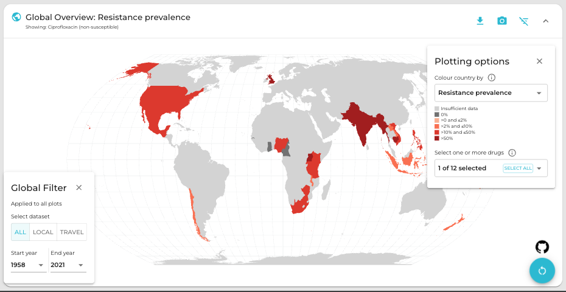
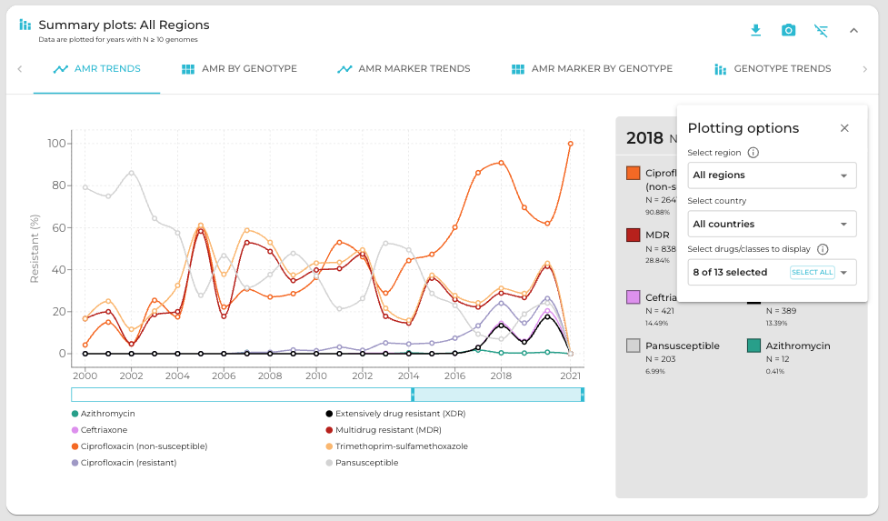

Dashboard overview
==================
.. raw:: html

   

        <b>Header</b>: Use the menu to <b>select a species or pathogen group</b> to display. Each pathogen has its own dashboard configuration that is customised to show genotypes, resistances and other relevant parameters. Numbers indicate the total number of genomes and genotypes currently available in the selected dashboard.
   

.. raw:: html
   
   

        <b>Map</b>: Use the <b>Plotting options</b> panel on the right to <b>select a variable to display per-country summary data</b> on the world map. Prevalence data are pooled weighted estimates of proportion for the selected resistance or genotype. Use the <b>Global filters</b> panel on the left to recalculate summary data for a specific time period and/or subgroup/s (options available vary by pathogen). A country must have N≥20 samples (using the current filters) for summary data to be displayed otherwise, it will be coloured grey to indicate insufficient data are available.
         Filters set in this panel apply not only to the map, but to all plots on the page. <b>Clicking on a country in the map</b> also functions as a filter, so that the <b>Summary plots</b> in the panels below reflect data for the selected country only. Per-country values displayed in the map can be downloaded by clicking the downward-arrow button at the top right of the panel. A static image (PNG format) of the current map view can be downloaded by clicking the camera icon.
   

.. raw:: html
   
   

        <b>Summary plots</b>: This panel offers a series of summary plots. The default view is <b>AMR TRENDS</b>. <b>Click a plot title</b> in the rotating selector at the top of the panel, to choose a different plot. The specific plots available vary by pathogen, as do the definitions of AMR and genotype variables (see per-organism details below). Summary plots are intended to show region- or country-level summaries, but if no country is selected they will populate with pooled estimates of proportion across all data passing the current filters.  
         

All plots are interactive. Use the <b>Plotting options</b> panel on the right to modify the region/country to display, or to select other options available for the current plot such as which variables to display, and whether to show <b>counts or percentages</b>.
         

Each plot has a dynamic legend to the right; click on an x-axis value to display counts and percentages of secondary variables calculated amongst genomes matching that x-axis value. For example, most pathogens will have a ‘AMR by genotype’ plot; click a genotype to display counts and percentages of resistance estimated for each drug or class.
         

Summarised values displayed in the current plot can be downloaded by clicking the downward-arrow button at the top of the Summary plots panel. A static image (PNG format) of the current plotting view can be downloaded by clicking the camera icon.
   

.. added summary plots figure

.. update downloads figure and add note for Documentation and removed last statement as we have PDF report for all the organisms now.

.. raw:: html
   
   

        <b>Downloads</b>: At the bottom are buttons to download <b>(1)</b> the individual genome-level information that is used to populate the dashboard (‘Download database (CSV format)’); <b>(2)</b> a static report of the currently displayed plots, together with a basic description of the data sources and variable definitions (‘Download PDF’) and <b>(3)</b> A link to documentation for AMRnet.
   

.. .. note::
..    Please note PDF reports are not yet available for all organisms, they will be added in future updates.

Individual pathogen details
---------------------------

*Salmonella* Typhi
~~~~~~~~~~~~~~~~~~

.. raw:: html
   
   

        <i>Salmonella</i> Typhi data in AMRnet are drawn from <a href="http://Pathogen.watch" target="_blank">Pathogenwatch</a>, which calls AMR determinants and <a href="https://doi.org/10.1093/infdis/jiab414" target="_blank">GenoTyphi</a> genotypes from genome assemblies. The Salmonella Typhi data in Pathogenwatch are curated by the <a href="https://www.typhoidgenomics.org" target="_blank">Global Typhoid Genomics Consortium</a>, as described <a href="https://doi.org/10.7554/eLife.85867" target="_blank">here</a>. The prevalence estimates shown are calculated using genome collections derived from non-targeted sampling frames (i.e. surveillance and burden studies, as opposed to AMR focused studies or outbreak investigations) with known year of isolation and country of origin. Last update: 24 May 2025.
   

**Variable definitions**

.. raw:: html
   
   

        <ul>
          <li><b>Genotypes</b>: GenoTyphi scheme, see <a href="https://doi.org/10.1093/infdis/jiab414" target="_blank">Dyson & Holt, 2021</a>.</li>
          <li><b>AMR determinants</b> are described in the <a href="https://doi.org/10.1038/s41467-021-23091-2" target="_blank">Typhi Pathogenwatch paper</a>.</li>
          <li><b>Travel-associated cases</b> are attributed to the country of travel, not the country of isolation, see <a href="https://doi.org/10.1371/journal.pntd.0007620" target="_blank">Ingle et al, 2019</a>.</li>
        </ul>
   

**Abbreviations**

.. raw:: html
   
   

        <ul>
          <li><b>MDR</b>: multidrug resistant (resistant to ampicillin, chloramphenicol, and trimethoprim-sulfamethoxazole)</li>
          <li><b>XDR</b>: extensively drug resistant (MDR plus resistant to ciprofloxacin and ceftriaxone)</li>
          <li><b>Ciprofloxacin NS</b>: ciprofloxacin non-susceptible (MIC &ge;0.06 mg/L, due to presence of one or more <i>qnr</i> genes or mutations in <i>gyrA/parC/gyrB</i>)</li>
          <li><b>Ciprofloxacin R</b>: ciprofloxacin resistant (MIC &ge;0.5 mg/L, due to presence of multiple mutations and/or genes)</li>
        </ul>
   

*Klebsiella pneumoniae*
~~~~~~~~~~~~~~~~~~~~~~~

.. raw:: html
   
   

        Klebsiella pneumoniae data are sourced from <a href="https://doi.org/10.1093/cid/ciab784" target="_blank">Pathogenwatch</a>, which calls AMR (using <a href="https://github.com/klebgenomics/Kleborate" target="_blank">Kleborate</a>) and genotypes (<a href="https://doi.org/10.1128/jcm.43.8.4178-4182.2005" target="_blank">MLST</a>) from genomes assembled from public data. Last update: 24 May 2025.
   

.. warning:: The *Klebsiella pneumoniae* data used in AMRnet are not yet curated for purpose-of-sampling, and therefore reflect the biases of global sequencing efforts which have been largely directed at sequencing ESBL and carbapenemase-producing strains or hypervirulent strains. Data curation efforts are ongoing however until then, please be careful when interpreting the data in the dashboard.

**Variable definitions**

.. raw:: html
   
   

        <ul>
          <li><b>Genotypes</b>: <a href="https://doi.org/10.1128/jcm.43.8.4178-4182.2005" target="_blank">7-locus MLST scheme</a> for Klebsiella pneumoniae, and sublineages (defined from core-genome MLST, as described <a href="https://doi.org/10.1093/molbev/msac135" target="_blank">here</a>), maintained by <a href="https://bigsdb.pasteur.fr/klebsiella/" target="_blank">Institut Pasteur</a>.</li>
          <li><b>AMR determinants</b> are called using <a href="https://github.com/klebgenomics/Kleborate" target="_blank">Kleborate v3</a>, described <a href="https://doi.org/10.1038/s41467-021-24448-3" target="_blank">here</a>. Fluoroquinolone resistance is defined as presence of an acquired qnr/qep gene OR a mutation in the quinolone-resistance determining regions of gyrA or parC.</li>
          <li><b>No acquired resistance</b>: no resistance determinants identified besides a wildtype beta-lactamase SHV allele associated with intrinsic resistance to ampicillin (i.e. not an ESBL or inhibitor-resistant variant of SHV, see <a href="https://www.microbiologyresearch.org/content/journal/mgen/10.1099/mgen.0.001294" target="_blank">Tsang et al 2024</a>).</li>
        </ul>
   

**Abbreviations**

.. raw:: html
   
   

        <ul>
          <li><b>ESBL</b>: extended-spectrum beta-lactamase</li>
          <li><b>3GC</b>: third-generation cephalosporins</li>
          <li><b>ST</b>: sequence type</li>
          <li><b>cgST</b>: core-genome sequence type</li>
        </ul>
   

*Neisseria gonorrhoeae*
~~~~~~~~~~~~~~~~~~~~~~~

.. raw:: html
   
   

        <i>Neisseria gonorrhoeae</i> data are sourced from <a href="https://doi.org/10.1186/s13073-021-00858-2" target="_blank">Pathogenwatch</a>, which calls AMR and lineage <a href="https://pubmlst.org/neisseria/" target="_blank">genotypes</a> (<a href="https://doi.org/10.1186/1741-7007-5-35" target="_blank">MLST</a>, <a href="https://doi.org/10.1086/383047" target="_blank">NG-MAST</a>) from genomes assembled from public data. The prevalence estimates shown are calculated using genome collections derived from non-targeted sampling frames (i.e. surveillance and burden studies, as opposed to AMR focused studies or outbreak investigations). These include EuroGASP <a href="https://doi.org/10.1016/s1473-3099(18)30225-1" target="_blank">2013</a> & <a href="https://doi.org/10.1016/s2666-5247(22)00044-1" target="_blank">2018</a>, and several national surveillance studies. Last update: 24 May 2025.
   

**Variable definitions**

.. raw:: html
   
   

        <ul>
          <li><b>Genotypes</b>: sequence types from the <a href="https://doi.org/10.1128/jcm.43.8.4178-4182.2005" target="_blank">7-locus MLST scheme</a> for Neisseria, or 2-locus N. gonorrhoeae multi-antigen sequence typing (<a href="https://doi.org/10.1086/383047" target="_blank">NG-MAST</a>) scheme, both hosted by <a href="https://pubmlst.org/neisseria/" target="_blank">PubMLST</a>.</li>
          <li><b>AMR determinants</b> are identified by Pathogenwatch using an inhouse dictionary developed and maintained in consultation with an expert advisory group, described <a href="https://doi.org/10.1186/s13073-021-00858-2" target="_blank">here</a>.</li>
          <li><b>AMR determinants within genotypes</b> - This plot shows combinations of determinants that result in clinical resistance to Azithromycin or Ceftriaxone, as defined in Figure 3 of <a href="https://doi.org/10.1186/s13073-021-00858-2" target="_blank">Sánchez-Busó et al (2021)</a>.</li>
          <li><b>Susceptible to cat I/II drugs</b> - No determinants found for Azithromycin, Ceftriaxone, Cefixime (category I) or Penicillin, Ciprofloxacin, Spectinomycin (category II) according to <a href="https://www.who.int/publications/i/item/9789241506021" target="_blank">WHO 2019 guidelines</a>.</li>
          <li><b>Azithromycin R</b>: MIC &ge;1 mg/L, MICs &gt;0.5 mg/L associated with presence of the <i>mph(A)</i> gene.</li>
          <li><b>Ceftriaxone R</b>: MIC &ge;0.125 mg/L, associated with presence of mosaic penA alleles or other penA mutations.</li>
          <li><b>Category I drugs</b>: azithromycin, ceftriaxone, cefixime</li>
          <li><b>Category II drugs</b>: penicillin, ciprofloxacin, spectinomycin</li>
        </ul>
   

**Abbreviations**

.. raw:: html
   
   

   <ul>
   <li><b> MDR </b>: multidrug resistant (Resistant to one of Azithromycin / Ceftriaxone / Cefixime [category I representatives], plus two or more of Penicillin / Ciprofloxacin / Spectinomycin [category II representatives])</li>
   <li><b> XDR</b>: extensively drug resistant (Resistant to two of Azithromycin / Ceftriaxone / Cefixime [category I representatives], plus three of Penicillin / Ciprofloxacin / Spectinomycin [category II representatives])</li>
   </ul>
   

.. note::

   These definitions are based on those defined in the `European CDC Response Plan <https://www.ecdc.europa.eu/sites/default/files/documents/multi-and-extensively-drug-resistant-gonorrhoea-response-plan-Europe-2019.pdf>`_, modified to use the specific representatives of category I and II antibiotic classes that are available in the dashboard.

*Escherichia coli*
~~~~~~~~~~~~~~~~~~~~~~~~~~~~~~~~~~

*Escherichia coli* data in AMRnet are drawn from `Enterobase <https://enterobase.warwick.ac.uk/>`__, which calls AMR genotypes using NCBI’s `AMRFinderPlus <https://www.ncbi.nlm.nih.gov/pathogens/antimicrobial-resistance/AMRFinder/>`_ and assigns lineages using MLST, `cgMLST <https://doi.org/10.1101/gr.251678.119>`_ and `hierarchical clustering <https://doi.org/10.1093/bioinformatics/btab234>`_. Last update: 24 January 2024.

.. warning::
   The *E. coli* data used in AMRnet are not yet curated for purpose-of-sampling, and therefore reflect the biases of global sequencing efforts which may be skewed towards sequencing AMR strains and/or outbreaks. Data curation efforts are ongoing however until then, please be careful when interpreting the data in the dashboard.

**Variable definitions**

- **Lineages**: Lineages are labeled by 7-locus sequence type (ST).

- **AMR determinants**: `Enterobase <https://enterobase.warwick.ac.uk/>`_ identifies AMR determinants using NCBI’s `AMRFinderPlus <https://www.ncbi.nlm.nih.gov/pathogens/antimicrobial-resistance/AMRFinder/>`_. AMRnet imports these AMR genotype calls, and assigns them to drugs/classes in the dashboard using the Subclass curated in `refgenes <https://doi.org/10.1099/mgen.0.000832>`_.

*Escherichia coli* (diarrheagenic)
~~~~~~~~~~~~~~~~~~~~~~~~~~~~~~~~~~

Enterobase classifies *E. coli* genomes to pathotypes using `this logic <https://enterobase.readthedocs.io/en/latest/pipelines/backend-pipeline-phylotypes.html?highlight=pathovar>`__. Pathotypes included in the *E. coli* (diarrheagenic) dashboard are:

- Shiga toxin-producing *E. coli* (STEC)
- Enterohemorrhagic *E. coli* (EHEC)
- Enterotoxigenic *E. coli* (ETEC)
- Enteropathogenic *E. coli* (EPEC)
- Enteroinvasive *E. coli* (EIEC)

Last update: 24 January 2024.

.. warning::
   The *E. coli* data used in AMRnet are not yet curated for purpose-of-sampling, and therefore reflect the biases of global sequencing efforts which may be skewed towards sequencing AMR strains and/or outbreaks. Data curation efforts are ongoing however until then, please be careful when interpreting the data in the dashboard.

**Variable definitions**

- **Lineages**: Lineages are labeled by the pathovar followed by the (7-locus) ST.

- **AMR determinants**: `Enterobase <https://enterobase.warwick.ac.uk/>`_ identifies AMR determinants using NCBI’s `AMRFinderPlus <https://www.ncbi.nlm.nih.gov/pathogens/antimicrobial-resistance/AMRFinder/>`_. AMRnet imports these AMR genotype calls, and assigns them to drugs/classes in the dashboard using the Subclass curated in `refgenes <https://doi.org/10.1099/mgen.0.000832>`_.

*Shigella* + EIEC
~~~~~~~~~~~~~~~~~~

.. raw:: html
   
   
 <i>Shigella</i> and enteroinvasive E. <i>coli</i> (EIEC) data in AMRnet are drawn from <a href='https://enterobase.warwick.ac.uk/' target='_blank'>Enterobase</a>, which calls AMR genotypes using NCBI’s <a href="https://www.ncbi.nlm.nih.gov/pathogens/antimicrobial-resistance/AMRFinder/" target="_blank" rel="noreferrer">AMRFinderPlus</a> and assigns lineages using <a href='https://doi.org/10.1101/gr.251678.119' target='_blank'>cgMLST </a> and <a href="https://doi.org/10.1093/bioinformatics/btab234" target="_blank"> hierarchical clustering </a>. Last update: 24 January 2024.

.. warning::

   The *Shigella* + EIEC data used in AMRnet are not yet curated for purpose-of-sampling, and therefore reflect the biases of global sequencing efforts which may be skewed towards sequencing AMR strains and/or outbreaks. Data curation efforts are ongoing however until then, please be careful when interpreting the data in the dashboard.

**Variable definitions**

.. raw:: html
   
   

      <ul>
            <li><b>Lineages</b>: The logic used by <a href="https://doi.org/10.1101/gr.251678.119" target="_blank">Enterobase</a> to classify genomes as <i>Shigella</i> or EIEC are detailed <a href="https://enterobase.readthedocs.io/en/latest/pipelines/backend-pipeline-phylotypes.html?highlight=shigella" target="_blank">here</a>. <i>Shigella sonnei</i> are monophyletic and labelled as lineage ‘S. <i>sonnei</i>’. For other <i>Shigella</i>, lineages are labeled by the species followed by the HC400 (<a href="https://enterobase.readthedocs.io/en/latest/features/clustering.html" target="_blank">HierCC</a>) cluster ID (as this nomenclature has been <a href="https://doi.org/10.1038/s41467-022-28121-1" target="_blank">shown to mirror the paraphyletic lineage structure of <i>Shigella</i>). EIEC lineages are labeled by ST (e.g. ‘EIEC ST99’).</li>
            <li><b>AMR determinants</b>: <a href='https://enterobase.warwick.ac.uk/' target='_blank'>Enterobase</a> identifies AMR determinants using NCBI’s <a href="https://www.ncbi.nlm.nih.gov/pathogens/antimicrobial-resistance/AMRFinder/" target="_blank" rel="noreferrer">AMRFinderPlus</a>. AMRnet imports these AMR genotype calls, and assigns them to drugs/classes in the dashboard using the Subclass curated in <a href="https://doi.org/10.1099/mgen.0.000832" target="_blank" >refgenes </a>.</li>
            <li><b>No acquired resistance</b>: no resistance determinants identified besides a wildtype beta-lactamase SHV allele associated with intrinsic resistance to ampicillin (i.e. not an ESBL or inhibitor-resistant variant of SHV, see <a href="https://www.microbiologyresearch.org/content/journal/mgen/10.1099/mgen.0.001294" target="_blank">Tsang et al 2024</a>).</li>
      </ul>
   

Escherichia *coli* (diarrheagenic)
~~~~~~~~~~~~~~~~~~~~~~~~~~~~~~~~~~

.. raw:: html
   
   
Escherichia <i>coli</i> (diarrheagenic) data in AMRnet are drawn from <a href='https://enterobase.warwick.ac.uk/' target='_blank'>Enterobase</a>, which calls AMR genotypes using NCBI’s <a href="https://www.ncbi.nlm.nih.gov/pathogens/antimicrobial-resistance/AMRFinder/" target="_blank" rel="noreferrer">AMRFinderPlus</a> and assigns lineages using MLST, <a href="https://doi.org/10.1101/gr.251678.119" target="_blank">cgMLST </a> and <a href="https://doi.org/10.1093/bioinformatics/btab234" target="_blank">hierarchical clustering </a>. The logic used by Enterobase to classify E. <i>coli</i> genomes to pathotypes is shown <a href="https://enterobase.readthedocs.io/en/latest/pipelines/backend-pipeline-phylotypes.html?highlight=pathovar" target="_blank">here </a>. Pathotypes included in the E. <i>coli</i> (diarrheagenic) dashboard are: 

- Shiga toxin-producing E. *coli* (STEC)
- Enterohemorrhagic E. *coli* (EHEC)
- Enterotoxigenic E. *coli* (ETEC)
- Enteropathogenic E. *coli* (EPEC)
- Enteroinvasive E. *coli* (EIEC)

Last update: 24 May 2025.

.. warning::
   The E. *coli* data used in AMRnet are not yet curated for purpose-of-sampling, and therefore reflect the biases of global sequencing efforts which may be skewed towards sequencing AMR strains and/or outbreaks. Data curation efforts are ongoing however until then, please be careful when interpreting the data in the dashboard.

**Variable definitions**

.. raw:: html

   

         <ul>
               <li><b>Lineages</b>: Lineages are labeled by the pathovar followed by the (7-locus) ST.</li>
               <li><b>AMR determinants</b>: <a href='https://enterobase.warwick.ac.uk/' target='_blank'>Enterobase</a> identifies AMR determinants using NCBI’s <a href="https://www.ncbi.nlm.nih.gov/pathogens/antimicrobial-resistance/AMRFinder/" target="_blank" rel="noreferrer">AMRFinderPlus</a>. AMRnet imports these AMR genotype calls, and assigns them to drugs/classes in the dashboard using the Subclass curated in <a href="https://doi.org/10.1099/mgen.0.000832" target="_blank">refgenes </a>.</li>
         </ul>
   

Escherichia *coli*
~~~~~~~~~~~~~~~~~~~

.. raw:: html
   
   

      Escherichia <i>coli</i> data visualized in AMRnet are sourced from <a href='https://enterobase.warwick.ac.uk/' target='_blank'>Enterobase</a>. Sequence types (STs) are assigned in silico via the Achtman MLST scheme, with novel STs created as needed, and unique core-genome MLST types derived from 2,513 loci. Pathovars are predicted by hierarchical clustering, while phylogroups are determined using ClermontTyper (v. 5 July 2019) and EzClermont (v. 25 August 2018). O:H serotypes (lipopolysaccharide + flagellar antigen combinations) and fimH alleles (v. 1 May 2017) are called with EcTyper and FimTyper, respectively. Antimicrobial-resistance genotypes are detected using NCBI’s <a href="https://www.ncbi.nlm.nih.gov/pathogens/antimicrobial-resistance/AMRFinder/" target="_blank" rel="noreferrer">AMRFinderPlus</a>. and virulence factors are identified via BlastFrost. For full details on pathovar prediction, MLST schemas, and other genotyping workflows, see the <a href="https://enterobase.warwick.ac.uk/docs/" target="_blank">Enterobase documentation </a>.
   

Last update: 24 May 2025.

.. warning::
   The E. *coli* data used in AMRnet are not yet curated for purpose-of-sampling, and therefore reflect the biases of global sequencing efforts which may be skewed towards sequencing AMR strains and/or outbreaks. Data curation efforts are ongoing however until then, please be careful when interpreting the data in the dashboard.

**Abbreviations**

.. raw:: html

   

         <ul>
               <li><b>MDR</b>: multidrug resistant (resistant to ampicillin, chloramphenicol, and trimethoprim-sulfamethoxazole)</li>
               <li><b>XDR</b>: extensively drug resistant (MDR plus resistant to fluoroquinolones and third-generation cephalosporins)</li>
               <li><b>Ciprofloxacin NS</b>: ciprofloxacin non-susceptible (MIC &ge;0.06 mg/L, due to presence of one or more <i>qnr</i> genes or mutations in <i>gyrA/parC/gyrB</i>)</li>
               <li><b>Ciprofloxacin R</b>: ciprofloxacin resistant (MIC &ge;0.5 mg/L, due to presence of multiple mutations and/or genes)</li>
         </ul>
   

*Salmonella* (invasive non-typhoidal)
~~~~~~~~~~~~~~~~~~~~~~~~~~~~~~~~~~~~~

.. raw:: html
   
   
<i>Salmonella</i> (invasive non-typhoidal) data in AMRnet are drawn from <a href='https://enterobase.warwick.ac.uk/' target='_blank'>Enterobase</a>, which calls AMR genotypes using NCBI’s <a href="https://www.ncbi.nlm.nih.gov/pathogens/antimicrobial-resistance/AMRFinder/" target="_blank" rel="noreferrer">AMRFinderPlus</a>, assigns lineages using MLST, <a href='https://doi.org/10.1101/gr.251678.119' target='_blank'>cgMLST </a> and <a href="https://doi.org/10.1093/bioinformatics/btab234" target="_blank">hierarchical clustering </a>, and assigns serotypes using <a href="https://doi.org/10.1371/journal.pone.0147101" target="_blank">SISTR </a>. The iNTS dashboard currently includes all genomes identified as serotype Typhimurium or Enteritidis (which account for <a href="https://doi.org/10.1016/S1473-3099(21)00615-0" target='_blank'>>90% of iNTS </a>), and identifies lineages thereof using MLST. Last update: 24 May 2025.

The invasive non-typhoidal *Salmonella* (iNTS) dashboard is populated with data from specific *Salmonella enterica* lineages that are associated with invasive disease in low-income countries; namely serotype Typhimurium (ST19, ST313 and sublineages thereof as defined by `Van Puyvelde et al <https://doi.org/10.1038/s41467-023-41152-6>`_) and Enteritidis (Central/Eastern and West African clades as defined by `Fong et al <https://doi.org/10.1099/mgen.0.001017>`_). Together these account for `>90% of iNTS <https://doi.org/10.1016/S1473-3099(21)00615-0>`_. Data in AMRnet are drawn from `Enterobase <https://enterobase.warwick.ac.uk/>`_, which calls AMR genotypes using NCBI’s `AMRFinderPlus <https://www.ncbi.nlm.nih.gov/pathogens/antimicrobial-resistance/AMRFinder/>`_, assigns lineages using MLST, `cgMLST <https://doi.org/10.1101/gr.251678.119>`_ and `hierarchical clustering <https://doi.org/10.1093/bioinformatics/btab234>`_, and assigns serotypes using `SISTR <https://doi.org/10.1371/journal.pone.0147101>`_. Last update: 24 January 2024.

.. warning::
   The iNTS data used in AMRnet are not yet curated for purpose-of-sampling, and therefore reflect the biases of global sequencing efforts which may be skewed towards sequencing AMR strains and/or outbreaks. Data curation efforts are ongoing however until then, please be careful when interpreting the data in the dashboard.

**Variable definitions**

.. raw:: html

   

         <ul>
            <li><b>Lineages</b>: Lineages are labeled by iTYM (invasive Typhimurium) or iENT (invasive Enteritidis) followed by the lineage name, defined from cgMLST as follows:</li>
            - iTYM ST19-L1: HC100-305  
            - iTYM ST19-L3: HC100=1547  
            - iTYM ST19-L4: HC100=48 
            - iTYM ST313-L1: HC200=9882  
            - iTYM ST313-L2: HC200=728 and HC50=728  
            - iENT CEAC: HC200=12675  
            - iENT WAC: HC200=2452  
            <li><b>AMR determinants</b>: <a href='https://enterobase.warwick.ac.uk/' target='_blank'>Enterobase</a> identifies AMR determinants using NCBI’s <a href="https://www.ncbi.nlm.nih.gov/pathogens/antimicrobial-resistance/AMRFinder/" target="_blank" rel="noreferrer">AMRFinderPlus</a>. AMRnet imports these AMR genotype calls, and assigns them to drugs/classes in the dashboard using the Subclass curated in <a href="https://doi.org/10.1099/mgen.0.000832" target="_blank">refgenes </a>.</ol>
         </ul>
   

*Salmonella* (invasive non-typhoidal)
~~~~~~~~~~~~~~~~~~~~~~~~~~~~~~~~~~~~~

.. raw:: html
   
   
<i>Salmonella</i> (invasive non-typhoidal) data in AMRnet are drawn from <a href='https://enterobase.warwick.ac.uk/' target='_blank'>Enterobase</a>, which calls AMR genotypes using NCBI’s <a href="https://www.ncbi.nlm.nih.gov/pathogens/antimicrobial-resistance/AMRFinder/" target="_blank" rel="noreferrer">AMRFinderPlus</a>, assigns lineages using MLST, <a href='https://doi.org/10.1101/gr.251678.119' target='_blank'>cgMLST </a> and <a href="https://doi.org/10.1093/bioinformatics/btab234" target="_blank"> hierarchical clustering </a>, and assigns serotypes using <a href="https://doi.org/10.1371/journal.pone.0147101" target="_blank">SISTR </a>. The iNTS dashboard currently includes all genomes identified as serotype Typhimurium or Enteritidis (which account for <a href="https://doi.org/10.1016/S1473-3099(21)00615-0" target='_blank'>>90% of iNTS </a>), and identifies lineages thereof using MLST. Last update: 24 May 2025.

.. warning::
   The iNTS data used in AMRnet are not yet curated for purpose-of-sampling, and therefore reflect the biases of global sequencing efforts which may be skewed towards sequencing AMR strains and/or outbreaks. Data curation efforts are ongoing however until then, please be careful when interpreting the data in the dashboard.

**Variable definitions**

.. raw:: html

   

         <ul>
               <li><b>Lineages</b>: Lineages are labeled by the serotype followed by the (7-locus) ST.</li>
               <li><b>AMR determinants</b>: <a href='https://enterobase.warwick.ac.uk/' target='_blank'>Enterobase</a> identifies AMR determinants using NCBI’s <a href="https://www.ncbi.nlm.nih.gov/pathogens/antimicrobial-resistance/AMRFinder/" target="_blank" rel="noreferrer">AMRFinderPlus</a>. AMRnet imports these AMR genotype calls, and assigns them to drugs/classes in the dashboard using the Subclass curated in <a href="https://doi.org/10.1099/mgen.0.000832" target="_blank">refgenes </a>.</li>
         </ul>
   

